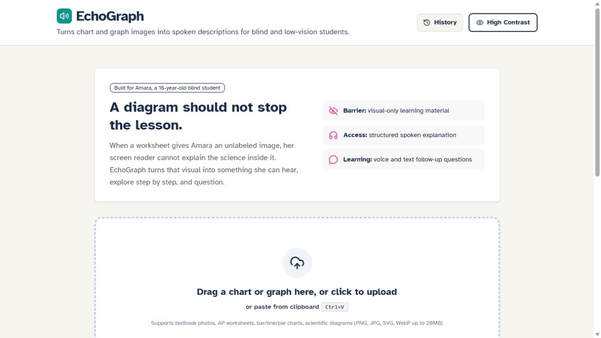
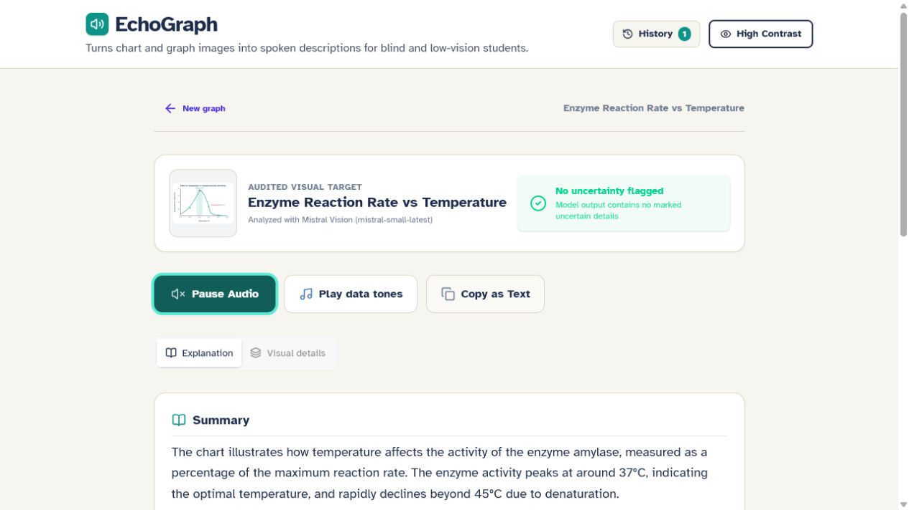
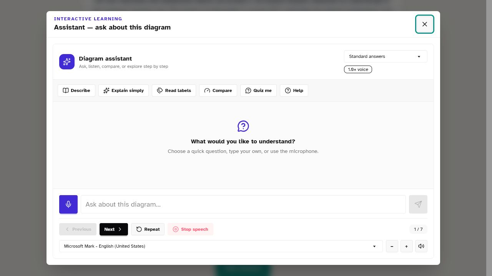

# EchoGraph


> An AI accessibility tutor that turns educational diagrams into spoken, interactive learning experiences for blind and low-vision students.

EchoGraph helps a student hear, explore, and question the knowledge contained in a graph, scientific diagram, flowchart, or worksheet image. It is a working hackathon prototype built around one narrow barrier: visual-only educational material that a screen reader cannot meaningfully describe.

## The problem

Meet Amara, a representative 16-year-old blind student taking AP Biology. Her digital lesson text is readable, but its charts and labeled diagrams may have missing alt text or an unhelpful filename such as `image_1.png`. The lesson is available; the knowledge inside its images is not.

This is not a claim to solve every accessibility problem. EchoGraph focuses on helping blind and low-vision students access educational visuals that block an otherwise accessible lesson.

## The solution

A student can:

1. Upload, drop, or paste an educational image.
2. Receive a structured explanation of its purpose, layout, visible text, values, and relationships.
3. Hear the explanation using an available browser voice.
4. Explore the diagram step by step.
5. Ask questions using text or the microphone.
6. Choose simple, standard, or detailed spoken answers.

This is more than image captioning: EchoGraph turns a visual into something a student can hear, explore, question, and learn from.

## Core features

- Mistral-powered chart and diagram understanding with exhaustive text extraction instructions.
- Learner-friendly sections for summary, structure, data, significance, and exact visual details.
- OpenCode Zen conversational tutor with a local diagram-grounded fallback.
- Browser text-to-speech, optional Mistral cloud speech, and separate summary/assistant voices.
- Groq Whisper speech-to-text with Mistral Voxtral fallback.
- Step-by-step diagram exploration, quick questions, quizzes, and answer-detail controls.
- Data sonification when real numeric values are detected.
- Screen-reader status announcements, semantic controls, keyboard navigation, visible focus, reduced motion, and high contrast.
- Device-aware language choices that only show languages with a playable browser voice.

## How it works

```text
Educational diagram
        |
        v
Mistral vision analysis
        |
        v
Structured diagram representation
        |
        +-----------------------> Accessible explanation -> Text-to-speech
        |
        v
OpenCode Zen tutor <----------- Student question
        ^                              |
        |                              v
        +---------------- Groq Whisper / Mistral Voxtral
```

Provider keys stay inside Netlify Functions. The browser calls `/.netlify/functions/*`; only the functions read private credentials from `process.env`.

## Technology

| Purpose | Implementation |
| --- | --- |
| Frontend | React 18, TypeScript, Vite |
| Interface | Tailwind CSS 4, daisyUI 5, Lucide icons |
| Vision | Mistral `mistral-small-latest`, then `ministral-8b-latest` fallback |
| Tutor | OpenCode Zen `nemotron-3-ultra-free`, then `laguna-s-2.1-free`; local grounded fallback |
| Speech-to-text | Groq `whisper-large-v3`, then Mistral `voxtral-mini-2602` fallback |
| Text-to-speech | Browser Web Speech API; optional Mistral `voxtral-mini-tts-2603` |
| Sonification | Browser Web Audio API |
| Hosting | Netlify static frontend and Netlify Functions |

## Accessibility

Accessibility shapes the workflow rather than decorating it afterward. The primary result is structured text, not another visual. Interactive controls have accessible names and keyboard behavior; status changes are announced through ARIA live regions; focus is visible; motion can be reduced; and a high-contrast mode is available. Voice input is optional, so microphone failure never blocks typed questions.

The prototype has not yet completed a formal audit with NVDA, JAWS, VoiceOver, or a representative user study. Those tests are the next validation step, not a completed claim.

## Local setup

Requirements: Node.js 20 or newer and npm.

```bash
git clone <your-repository-url>
cd echograph
npm install
copy .env.example .env
npm run dev:netlify
```

Open [http://localhost:8888](http://localhost:8888). On macOS or Linux, use `cp .env.example .env` instead of `copy`. Netlify Dev reads the local `.env`, starts Vite on port 3000, and proxies the Netlify Functions without exposing the keys to frontend JavaScript.

At minimum, set `MISTRAL_API_KEYS` for live image analysis. Add `OPENCODE_API_KEYS` for AI tutor responses and `GROQ_API_KEYS` for the primary microphone transcription path. Values can be comma-separated to enable key rotation. Never expose these variables with a `VITE_` prefix in production.

```bash
npm test
npm run build
npm run preview
```

## Deploy to Netlify

1. Push the repository to GitHub and import it into Netlify.
2. Keep the build command as `npm run build`, publish directory as `dist`, and functions directory as `netlify/functions`.
3. In **Project configuration -> Environment variables**, add `MISTRAL_API_KEYS`, `OPENCODE_API_KEYS`, and `GROQ_API_KEYS` with the Functions scope (or all scopes). Add `MISTRAL_VOICE_ID` only if cloud TTS is configured for the account, and optionally add `OPENCODE_MODEL_ORDER`.
4. Deploy, then test image analysis, tutor input, microphone permission, and audio in an incognito/private browser.

The included [`netlify.toml`](./netlify.toml) configures Vite, the functions directory, Netlify Dev, and the SPA fallback. Real keys belong only in Netlify environment variables or the ignored local `.env`; never create `VITE_*` versions of provider credentials.

## Current implementation

### Fully implemented

- Upload, drag/drop, clipboard paste, image optimization, and sample diagrams.
- Server-side Mistral vision analysis with a second model fallback.
- Structured and learner-friendly results with explicit uncertainty reporting.
- Background OpenCode explanation refinement and conversational tutoring.
- Local tutor fallback when OpenCode is unavailable.
- Browser speech output, voice selection, playback controls, and real-value sonification.
- Microphone recording with Groq-to-Mistral transcription fallback.
- Onboarding preferences, explanation levels, high contrast, reduced motion, and session history.
- Netlify Functions for vision, tutoring, transcription, and optional cloud speech.

### Experimental or environment-dependent

- AI output can still misread low-resolution text; uncertain elements are surfaced but not independently verified by a second vision pass.
- Cloud TTS requires a valid Mistral voice profile; browser speech is the standard fallback.
- Available languages and voices depend on the browser and operating system.
- Microphone input requires HTTPS outside localhost and user permission.
- Session history is in memory and is not persisted across reloads.
- Formal assistive-technology and target-user testing is still outstanding.

## Screenshots







## AI and tool disclosure

AI services used while the app runs:

- Mistral `mistral-small-latest` and `ministral-8b-latest` for image understanding.
- OpenCode Zen `nemotron-3-ultra-free` and `laguna-s-2.1-free` for tutoring and detailed explanation refinement.
- Groq `whisper-large-v3` for primary speech-to-text.
- Mistral `voxtral-mini-2602` for speech-to-text fallback.
- Mistral `voxtral-mini-tts-2603` for optional cloud TTS; browser Web Speech is the default available fallback.

AI coding tools used while building the project:

- Google Antigravity for earlier architecture and UI implementation work.
- OpenAI Codex for debugging, accessibility refinements, testing, documentation, and deployment packaging.

Datasets: none. The bundled demonstration diagrams are project-authored inline SVG fixtures and do not use an external dataset.

## Repository guide

- [`src/`](./src) - React interface, accessibility services, and browser capabilities.
- [`server/`](./server) - provider integrations and shared server logic.
- [`netlify/functions/`](./netlify/functions) - Netlify serverless handlers that protect provider keys.
- [`api/`](./api) - Legacy Vercel handlers retained for backwards compatibility.
- [`tests/`](./tests) - focused regression tests for structured output and voice selection.
- [`docs/ONE_PAGER.md`](./docs/ONE_PAGER.md) - two-minute hackathon overview.

## License

No license file has been selected. The project is not automatically open-source until the owner chooses and adds a license.
